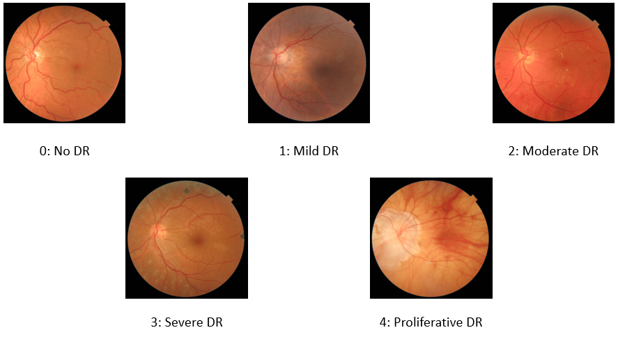
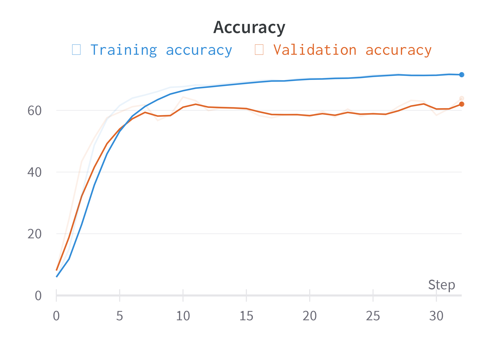
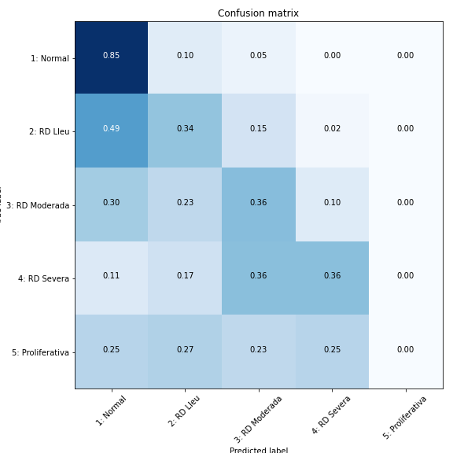

# 1. Introduction and motivation

Retinopathy is the leading cause of vision loss in working-age adults worldwide. To assess lesions, routine screening is recommended. However, this yields an overwhelming number of images to read for ophthalmologists. 

To this end, the development of a Deep learning application that can automatically relieve this burden is studied.

The four authors of this study are somehow related to the medical -imaging- field and, thus, their complementary scopes of expertise contribute in each phase of the project: documentation, data acquisition, data pre-processing, deep learning modeling and interpretation of the results from both an engineering and clinical perspective.

## 1.1. Objectives

The main goal of this project was to understand and work with clinical images to tackle real-life problems. We wanted to try different approaches to see which want better solves the problem. Also, since we had metadata asociated with the patients, we wanted to add it to the network, even check if the images were necessary. To sum up, our objectives were:

* Preprocess and transform the dataset in a good way.
* Deal with a high imbalanced dataset and try different methods
* Try different CNN architectures and compare the results.
* Study and work with the metadata. Include the tabular data in the models. 
* Understand what are the models doing by performing interpretability.

# 2. Data 

We have been able to work with a large, labeled dataset from the Catalan Health Department (CATSALUT). It consists of data corresponding to the usual screening in diabetic patients. For every patient we have data related to the disease as well as the retinal fundus images of both eye. The entire dataset consists of 99670 images, although this number got reduced after the data cleaning.

Due to the nature of the screenings, it is highly imbalanced, with much more data in the non-retinopathy label. In order to not having to deal with the imbalanced problem, first we run the codes with a smaller, balanced dataset and then, when they learned a bit, with the whole dataset.

## 2.1. Data description
### 2.1.1 Images

The dataset consists in eye fundus images of screenings from patients with diabetes. This images are labeled from 0 to 4 depending on the severity of diabetic retinopathy, with 0 meaning that the patient has no disease and 4 being the most severe class. Here are some examples of images in the dataset:

<p align="center">
  
</p>

Data cleaning is done to delete from the dataset non-retinal fundus images and non-standard acquisition of the eye fundus.

<p align="center">
  
</p>

After data cleaning, we are left with a dataset consisting of 82275 images, each class having the following number of images:

<p align="center">
  
</p>

Plotting the histogram of the classes, we observe that the dataset is highly imbalanced towards the healthy class (0: No DR). This is common in medical datasets, and it will be a problem to be faced during training.

<p align="center"> 
   
</p>

### 2.1.2 Metadata
Image data is accompanied with a csv file that contains tabular data for each 
image, representing clinical and laboratory data related to the onset and severity of diabetic retinopathy (DR). 

The following columns are included in the csv file:

1.   ID_Image.
2.   Eye: left or right.
3.   Retinopathy: grade of DR based on the “Diabetic Retinopathy Severity Score (DRSS)”.
      ``` classes = ('1: Normal','2: Non-proliferative mild DR','3: Non-proliferative moderate DR','4: Non-proliferative severe DR',  '5: Proliferative DR')  ```
4.   Age.
5.   Sex: male or female.
6.   HbA1c: glycosylated hemoglobin, a measure of the glucose levels in blood.
7.   Total Cholesterol.
8.   LDL: "bad" cholesterol.
9.   HDL: "good" cholesterol.
10.  Systolic Arterial Pressure.
11.  Diastolic Arterial Pressure.
12.  Cardiovascular Risk Score. 


## 2.2. Data preprocessing

### 2.2.1. Metadata
### 2.1.1.1 NaN and outlier Imputation
A quick overview on the dataset revealed null values in some columns, represented in the following image as % of the total length of the data.

<p align="center">
  

The column “Cardiovascular Risk Score” was dropped since it contained almost 60% of null values and it is a score based on several clinical and laboratory data, which were not available. 

NaN imputation was performed with three different methods using sklearn library:


*   ```SimpleImputer() ```: mean, median, moda.
*   ```KNNImputer()```: with K = 5.
*   ```IterativeImputer()```.

The dataset was also checked for outlier values using the standard deviation method, which assumes a value is an outlier if it is outside the 3 standard deviation range.


<p align="center">
  

Identified outliers were imputed using the mean of each distribution.

After imputation we checked that each variable followed a normal distribution. The following image represents the kurtosis and skewness of the dataset imputed with the mean, which was almost identical to the other 2 imputations performed.

<p align="center">
  

As seen kurtosis values for each column are close to 0 and within the +/- 3 range, so we can assume each variable follows a normal distribution with a mesokurtic shape.
Skewness is also close to 0, so the normal distribution is symmetric. 
Bellow there is a representation of the normal distribution of Systolic Arterial Pressure in the mean imputed dataset.

<p align="center">
  

Finally, the correlations between the different numerical variables were also analyzed to check if there were linear correlations between variables. As seen in the following table there is linearl correlation between LDL and Total Cholesterol at around 0.7, which is to be assumed since Total Cholesterol formula includes LDL, and it is the main factor contributing to the total amount of blood cholesterol. 

<p align="center">
  


### 2.1.1.2 Data Transformation
Numerical Data Normalization was done with ```MinMaxScaler()``` method from the sklearn library. Numerical Data Standarization was also performed with the ```StandardScaler()``` method from the sklearn library.

Categorical Data was one-hot coded with ```OneHotEncoder()``` method from the sklearn library.


### 2.2.2. Images

The images have been preprocessed once and then saved, in order to lighten the transformations done each epoch. The preprocessing is the one found on the best code of a Kaggle competition on Diabetic eyes with small changes. The procedure is the following:

1. Crop the eye from the black and center it.
2. Resize all the images to 
3. Stabilize the color.
4. Ben coloring. It consists in adding coloring so that it emphasiz the veins and defects of the eye.


<p align="center">
   
   
</p>

First we worked without any preprocessing of the images, then with a black and white one instead of the Ben coloring, which showed some improvement and finally with this, the Ben Color with noticeable results.

### 2.2.3. Data augmentation
Due to the highly imbalanced dataset, we have very few samples in the less represented classes. So in order to prevent overfitting, we must do some data augmentation. We will use [Albumentations](https://albumentations.ai/), a fast data augmentation library for Pytorch. In our case, it has proven to be much faster than using torchvision transforms.

Data augmentation is randomly done at batch level, that is, for each image at the batch we apply the following transforms with a probability :

*   Horizontal Flip: With probability  = 0.5
*   Vertical Flip: With probability  = 0.5
*   Rotation: A random rotation of (-180, 180) degrees with probability  = 1

These transforms don’t modify the medical label of the image and give us sufficient variance to prevent overfitting.

<p align="center">
  
  
  # 3. Metrics and analysis of the results

In this section we introduce the different metrics that are used during the experiments. 

*   **Accuracy**: Is the usual metric in classification, gives the ratio between correct predictions and the total number of predictions.

*   **Quadratic weighted Kappa**: Measures the agreement between two ratings. This metric typically varies from 0 (random agreement between raters) to 1 (complete agreement between raters). In the event that there is less agreement between the raters than expected by chance, this metric may go below 0 up to -1.

*   **Confusion matrix**: Matrix that shows the predictions of the model for each one of the classes. Is a very useful interpretation technique for classification problems.

In the model of section 4.5 we also consider metrics like precision, recall and F1-score to study the hypotetical clinical relevance of the model.
  
# 4. Models

## 4.1. Binary classification

### 4.1.1. Objectives

In our first experiments we tried to classify images in 5 different classes using a model trained from scratch, but first preliminary results suggested that the imbalancing of the dataset was yielding to poor results. Thus, we decided to experiment with another approach where a first classification model could detect whether any type of retinopathy was present.

This would aim to, if further in the path we still struggle with the multi-class classification, only use the cases where this binary classification outputs evidence of pathology for a classification of the severity of the lesion.

<p align="center">
  
</p>

### 4.1.2. Experiment setup

A ResNet-50 architecture pretrained on ImageNet was used. The latest layers of the network were modified in such a way that the Fully Convolutional Layer of the network would lead to a single scalar instead of a n-size array. A final Sigmoid activation layer was introduced to ensure that the output was constrained between 0 and 1:

```
    model = models.resnet18(pretrained = True).to(device)
    for param in model.parameters():
        param.requires_grad = False

    num_ftrs = model.fc.in_features
    model.fc = nn.Sequential(
        nn.Linear(num_ftrs,256),
        nn.ReLU(),
        nn.Dropout(0.3),
        nn.Linear(256,128),
        nn.ReLU(),
        nn.Linear(128,1),
        nn.Sigmoid()
    )
  
```

Initially, a Binary Cross Entropy loss function was used and the standard Adam optimizer was selected for the training. However, we quickly observed that the dataset was still imbalanced towars the class 0. Thus, a loss function with the corresponding weights was finally used for the training.

Instead of the regular torch.argmax( ) used for multiclass classification, a threshold with respect to 0.5 was used to assign a label to each prediction.

### 4.1.3. Results

In order to track the different results obtained when tuning the hyperparameters, the model was trained and evaluated on the wandb platform for quick visualization and storage of the loss and accuracy of each model.

The neural network was trained during 50 epochs with the following results:

<p align="center">
  
   
</p>

<p align="center">
   
</p>

The validation loss curve show us that the model learns until, more or less, epoch 30. Then, it gets stuck and the improvements in the training set doesn't generalize to the validation set.

However, when we obvserve the confusion matrix, we expected better results for the binnary classification task. It is true that the network has learned something as the diagonal of the matrix is most prominent, but it is still far from a good classifier, specially in the medical domain.

Thus, we didn't spend more time in this approach and decided to move on with other architectures to tackle it directly as a multi-classification problem.

## 4.2. Multiclass Classification Network

### 4.2.1. Objectives

The objective of this experiment is to train a model that classifies a fundus eye image into one of the following classes:

*   No DR
*   Mild DR
*   Moderate DR
*   Severe DR
*   Proliferative

In this experiment, we distinguish between the different grades of diabetic retinopathy (not only a binary classification).

### 4.2.2. Experiment setup

A ResNet-34 model architecture pretrained on ImageNet has been used. The last fully connected layer has been replaced to have as output the correct number of classes (5 in our case).

The whole network is trained at the same time (fine-tuning) using Adam optimizer with a learning rate of 1e-6. Bigger learning rates have been tested, but we haven't achieved convergence with those. 

Cross entropy loss has been chosen as the loss function, as it is the most common approach for classification problems. The contributions to the loss of each class has been weighted to take care of class imbalance. In particular, we define
<p align = "center">

</p>

as the weight of class , being  the number of samples of class  and  the total number of samples.

### 4.2.3 Results

The neural network is trained during 31 epochs with the following results:

<p align="center">
  
   
</p>

<p align="center">
   
   
</p>

The validation loss curve show us that the model learns until, more or less, epoch 15. Then, it gets stuck and the improvements in the training set doesn't generalize to the validation set.

Observing the confusion matrix, we can infer that even the accuracies aren't great, the network has learned some sense of what is each class and predicts itself more than other class.


## 4.3. Ordinal Regression Network

### 4.3.1. Objectives

In the firsts attempts, we found that it was hard for the neural network to understand that it is a ranking classification. Thus, the images not predicted correctly did not fall at near classes. In order to correct this problem, we tried an ordinal regression network.

### 4.3.2. Experiment setup

Instead of the one-hot encoding that we use as in the previous networks, now we will use one that helps to understand the ordering nature. In a vector of dimension 5 we will encode label j as the last j elements as 1 and 0 the other ones. That is, label 3 would correspond to 

<p align = "center">


</p>

The contrary (considering a 3 as 
) has also been considered, because we thought that our ordering would priorize the normal class, since an output of  is classified as label 0, so by chance it seems easier to classify the results to lower levels of retinopathy, which is also the classes that have more data. However, the results using both methods are really similar.

The code has been adapted to introduce this change and do the translations:


*   The model has also been changed, since now we have to finish it with a *Sigmoid* function, so that all elements in the vector are between 0 and 1.
*   The usual loss function is not valid anymore, and we have had to adapt it. We have used weights as before to tackle the umbalanced dataset. 
*   For the accuracy and other measures we have to translate the labels as a vector of dimension 5 as before, or the reverse translation, from a vector of dimension 5 to its one-dimension label.

We have used the *MSELoss* because it showed slightly better results in this case than the *CrossEntropyLoss*. 

After different setups, we found that the best one for us was the simplest one with a low learning rate, as in the classification problem. Adding more layers or complexificating them led to a lot more training time and not so better results. We have used a pretrained Resnet50, although we think that similar results could be found with a less complex Resnet. 

### 4.3.3. Results

The following images correspond to a run with learning rate  and Resnet50:

<p align="center">
   
   
</p>
<p align="center">
   
   
</p>

This approach did not produce the desired effect. Although the shape of the confusion matrix is kind of diagonal, the results are not much better than using a classification algorithm that does not consider the ordering of the classification in a similar epoch. 


## 4.4. Image and metadata Network

### 4.4.1. Objectives
Our dataset not only had images, but also metadata that explained the gravity of the diabetes. A more advanced diabetes could lead more easily to a high level of retinopathy, so we introduced them to our model. We want to see if this increases the performance of our previous network, as well as which importance does it give to the metadata in comparison with the image.

### 4.4.2. Experiment setup

We used a pretrained Resnet34 model for the images and concatenate the result of it with a model with the metadata and the final layer. 

<p align="center">
  
</p>

However, this showed to be too computational expensive and we opt for a more simple network: The Resnet34 network concatenated with the metadata and a final layer. We trained the whole model but used the pretrained imagenet Resnet34.

On the other hand, we tried both classification and ordinal regression with similar results, so we focus what we present here, the classification model including metadata. We used a low learning rate of .

Finally, we did another experiment. We had our best image classification model and concatenate it with the data (concatenating the 5-layer final output with the 8-layer input metadata).

As explained before, there are different ways to input the NaNs in the metadata. The figures presented here uses Knn inputation, but the other results were similar.

### 4.4.3. Results

Here we can see the results of the image-metadata model with Resnet34 pretrained with Imagenet:

<p align="center">
   
   
</p>
<p align="center">
   
   
</p>

We can see that the model is learning but, although the confusion matrix is not random, it is is not better than using the images alone. Also, we observe (in this run and in all runs done) that the confusion matrix is a lower triangular matrix. Understanding this output maybe could help us.

As a surprise, it started much better than using the best output of our classification model as initial input. This could be because of the chosen architectures for each type:

<p align="center">
   
   
</p>
<p align="center">
   
   
</p>

## 4.5. Metadata with Machine Learning

### 4.5.1. Objectives

### 4.5.2. Experiment setup

We tried two different approaches. First, we deployed a deep neural network with one or more hidden layers (8,124,5), but as much as we tunned it, adding/deleting layers, changing its neurons... we could not make it learn enough, it always led to focus only in one or two predicted labels.

The second approach consisted on using machine learning. Light Gradient Boosted Machine or Light GBM was the algorithm selected for performing this task since it is the state-of-the-art for traning and predicting tabular data models.

The model was tested using the different imputed datasets explained in 2.2, and with both numerical transformation methods. The multiclass approach was done since it yield better results than the binary approach. 

First, the baseline model was tested for each dataset, without hyperparameter tunning. Later on, since the dataset contained imbalanced data the model was retrained using ```class_weight``` parameter, with the following weights per class.

<p align="center">
  

Hyperparameter tunning was performed in the following parameters:

*   ```n_estimators```: number of decision trees used in the ensemble.
*   ```max_depth```: maximum tree depth for base learners. It controls how specialized each tree is to the training dataset: how general or overfit it might be. Trees are preferred that are not too shallow and general and not too deep and specialized.
*   ```num_leaves```: maximum tree leaves for base learners. Ideally, the value of num_leaves should be less than or equal to 2^(```max_depth```). Value more than this will result in overfitting.
*   ```learning_rate```: boosting learning rate. 
*   ```boosting_type```: gbdt or traditional Gradient Boosting Decision Tree. dart or Dropouts meet Multiple Additive Regression Trees and goss or Gradient-based One-Side Sampling.

Different tests were performed for selecting the best hyperparameters. The best combination tested for every imputed dataset was ```{"n_estimators": 2000, "max_depth": 14, "learning_rate": 0.2, "boosting_type": "goss"}```.

The following function was used to implement the Light GBM.

```
def raw_lightgbm_final(dataset, scaler, weights, estimators, depth, lr, boost):
  X = data_transformation(dataset, scaler)[0]
  y = dataset["Retinopathy"].values
  X_train, X_test, y_train, y_test = train_test_split(X, y, test_size = 0.2, random_state = 0)
  model = LGBMClassifier(objective = "multiclass", class_weight = weights, n_estimators = estimators, max_depth = depth, num_leaves = 2**depth, learning_rate = lr, boosting_type = boost) # multiclass.
  model.fit(X_train, y_train) # fit the model.
  y_pred = model.predict(X_test) # predict the results.
  accuracy = accuracy_score(y_pred, y_test) # check accuracy
  

  cm = confusion_matrix(y_test, y_pred) # get the confusion matrix.
  cm_matrix = pd.DataFrame(data=cm, columns=[i for i in range(1, 6)], 
                                  index=[i for i in range(1, 6)])
  

  report = classification_report(y_test, y_pred)

  return accuracy, cm, cm_matrix, report
  ```

### 4.5.3. Results

The final results were independent of the NaN imputation and transformation used, with minor differences probably due to the stochastic nature of the algorithm. Median and moda imputation were not used. 

The first approach using the base model with tunning and without ```class_weight```showed moderately good results considering data imbalance, with the following confusion matrix

<p align="center">
  

As seen, the model predicts the normal class since the data is overloaded with the class, but also has a decent performance in distinguish the most severe grades. However, it can not distinguish mild grades from normal.

After performing ```class_weight``` the results improved dramatically, being able to better classify non-normal grades while lowering normal grade performance.

<p align="center">
  

Finally, the last model with the hyperparameter tunning yield much better results than the previous ones.

<p align="center">
  

The trained model had an overall accuracy of 0.96 and recall values for each category of 0.98, 0.76, 0.84, 0.79 and 0.64 respectively. While the accuray is quite high the recall values for the different categories are still far from what should be desired since the goal of the retinal screening is to not miss pathological eyes. Hence recall values should be higher, in the order of > 0.95 for an effective screening method. However, it yields excellent results considering the few categories studied in the model and other limitations.

Finally, the feature importance was plotted, shown in the figure bellow. It is surprising that HbA1c has a low importance considering blood glucose is the main pathophysiological mechanism of DR. It is also quite shocking that eye laterality has a relative importance, which may be due to intrinsic problems in the data. 

<p align="center">
  
